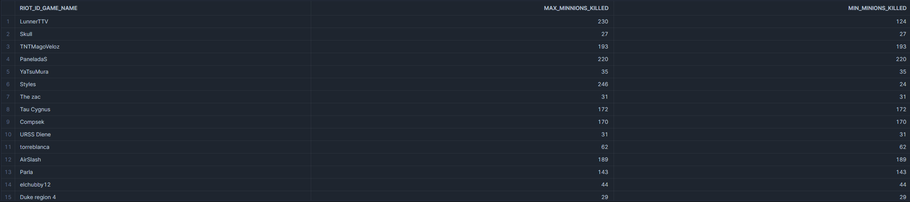
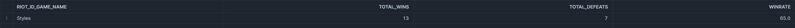
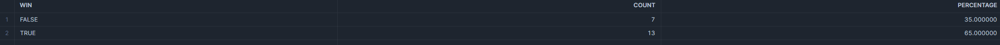
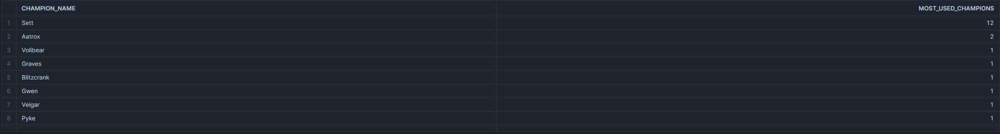
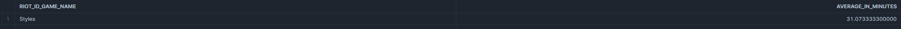
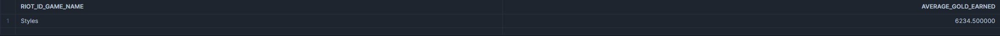
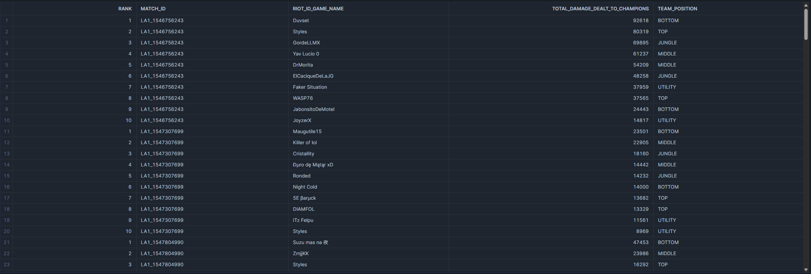

# Overview

This is a Jupyter Notebook where I extract data from League of Legends API, transform it and dump that data into Snowflake and CSV files(optional). 
Try to open the jupyter notebook [here](https://github.com/StylesAW/data_modeling/blob/main/data_modeling.ipynb)

**The second part of this project is the repository [league_data_ETL_pipeline](https://github.com/StylesAW/league_data_ETL_pipeline) , where the process is automated using different technologies.**

## Setting Up the Environment

To get started, you can consider to set up a virtual environment and install the required dependencies. Follow these steps:

### 1. Create a Virtual Environment

First, create a virtual environment in your project directory. You can do this by running the following command:

```bash
python -m venv venv
```

### 2. Install Required Packages

With the virtual environment activated, install the dependencies listed in the `requirements.txt` file by running:
```bash
pip install -r requirements.txt
```
This command will install all the necessary libraries to run the Python script.

### 3. Set Up Snowflake

To use this project, you'll need to create an account in Snowflake. Once your account is set up, follow the next:

- **Run the SQL Query**: Execute the query provided in the `query_snowflake.sql` file. This query will set up the necessary architecture in Snowflake to store and manage the data extracted from the League of Legends API. You can find this file [query_snowflake](https://github.com/StylesAW/data_modeling/blob/main/query_snowflake.sql)

## Data Check

To ensure everything is functioning correctly, I will present some queries that I performed to explore the data. These queries were designed to investigate the data and provide insights into its quality. The queries can be found in the `Analysis/analytical_queries.sql` file or clicking [analytical_queries](Analysis/analytical_queries.sql).

### Player Performance Analysis: Styles

The following query extracts the performance statistics of the specific player **Styles** for each champion, including data on kills, deaths, and assists. It also calculates the **KDA (Kill/Death/Assist)** ratio, which provides insight into the player's performance with that specific champion.

#### Understanding the KDA Calculation

The KDA ratio is a measure of a player's skill and effectiveness during a game. It is calculated as follows:

1. **Sum the number of kills and assists** performed by the player.
2. **Divide the result by the number of times the player died** during the match.
3. The resulting value is the **FINAL KDA**, where a higher KDA indicates superior performance and skill with the champion.


```sql
SELECT 
    riot_id_game_name,  
    CHAMPION_NAME,
    COUNT(*) as times_played,
    SUM(kills) as total_kills,
    SUM(assists) AS total_assists,
    SUM(deaths) AS total_deaths,
    ROUND((SUM(kills) + SUM(assists)) / NULLIF(SUM(DEATHS),0),3) AS KDA,
FROM matches
WHERE riot_id_game_name = 'Styles'
GROUP BY riot_id_game_name, champion_name
ORDER BY KDA DESC
```

### Result


***

### Most Used Items Analysis: Styles

The following query displays the most frequently used items by the player **Styles**, along with their relevant data as id, name and gold total. It excludes items that are not relevant to this analysis, such as **'Farsight Alteration'**, **'Oracle Lens'**, and **'Stealth Ward'**, as these are vision options and do not directly impact the player's performance.

#### Purpose of the Query

This query helps identify the key items that contribute to the player's performance by focusing only on those that provide meaningful gameplay advantages. By filtering out vision items, the analysis remains focused on combat-related choices. A CTE was used to enhance the clarity and readability of the main query.

```sql
WITH items_union_cte AS (
    SELECT riot_id_game_name, match_id, item0 AS item_id FROM matches
    UNION ALL
    SELECT riot_id_game_name, match_id, item1 FROM matches
    UNION ALL
    SELECT riot_id_game_name, match_id, item2 FROM matches
    UNION ALL
    SELECT riot_id_game_name, match_id, item3 FROM matches
    UNION ALL
    SELECT riot_id_game_name, match_id, item4 FROM matches
    UNION ALL
    SELECT riot_id_game_name, match_id, item5 FROM matches
    UNION ALL
    SELECT riot_id_game_name, match_id, item6 FROM matches
)
SELECT
    A.riot_id_game_name,
    B.id,
    B.name,
    B.plaintext,
    B.gold_total,
    COUNT(B.name) AS most_used_items
FROM
    items_union_cte A
INNER JOIN 
    items B
ON 
    A.item_id = B.id
WHERE 
    A.riot_id_game_name = 'Styles'
    AND B.name NOT IN ('Farsight Alteration', 'Oracle Lens', 'Stealth Ward')
GROUP BY 
    A.riot_id_game_name, 
    B.id, 
    B.name, 
    B.plaintext, 
    B.gold_total
ORDER BY 
    most_used_items DESC
LIMIT 10;
```

### Result 


***

## Minions Killed Analysis after 20 Minutes

The following query shows the maximum and minimum number of minions killed by a player after the 20-minute mark. This analysis helps to understand the player's late-game performance and efficiency in farming.

### Purpose of the Query

This query aims to capture the extremes in minion kills, providing insight into the player's ability to farm effectively in the late stages of the game. It focuses on the period after the 20-minute mark to assess early-game efficiency.

```sql
SELECT
    riot_id_game_name,
    MAX(total_minions_killed) AS max_minnions_killed,
    MIN(total_minions_killed) AS min_minions_killed
FROM MATCHES
WHERE (game_duration/60) > 20
GROUP BY riot_id_game_name
```

### Result


## Winrate Analysis: Styles

The following query displays the total number of wins, total defeats, and the winrate of the player **Styles**. This analysis provides a clear view of the player's overall performance in terms of game outcomes.

### Purpose of the Query

This query helps to evaluate the success rate of Styles by calculating his winrate, which is a key metric to understand the effectiveness and consistency of the player in matches.

```sql
SELECT 
    riot_id_game_name,
    COUNT(CASE WHEN win = TRUE THEN 1 END) AS total_Wins,
    COUNT(CASE WHEN win = FALSE THEN 1 END) AS total_defeats,
    ROUND(total_wins * 100 / COUNT(*),1) AS Winrate
FROM matches
WHERE riot_id_game_name = 'Styles'
GROUP BY riot_id_game_name
```

Result


The purpose of this query is to highlight how often the player loses matches, which, along with the winrate, helps to provide a more complete picture of Styles' overall gameplay effectiveness.

```sql
SELECT
win,
COUNT(*) AS count,
COUNT(*) * 100 / (SELECT COUNT(*) FROM matches WHERE riot_id_game_name = 'Styles') AS percentage
FROM matches
WHERE riot_id_game_name = 'Styles'
GROUP BY win
```

Result


## Most Used Champions Analysis: Styles

The following query displays the most frequently used champions by the player **Styles**. This analysis helps identify which champions Styles prefers and often relies on in his gameplay, providing insights into his playstyle and strategic preferences.

### Purpose of the Query

This query aims to highlight the champions that Styles uses most often, shedding light on his preferred picks and the champions with which he feels most comfortable or effective.

```sql
SELECT champion_name, COUNT(champion_name) AS most_used_champions
FROM matches
WHERE riot_id_game_name = 'Styles'
GROUP BY CHAMPION_NAME
ORDER BY most_used_champions DESC
```

Result


## Average Match Duration Analysis: Styles

The following query shows the average duration of matches played by the player **Styles**, measured in minutes. This metric provides insights into the typical length of games for Styles, which can reflect his playstyle and game strategy.

### Purpose of the Query

The goal of this query is to calculate the average match duration for Styles, helping to understand whether his games tend to be short, average, or extended in length, which can be indicative of his team’s play dynamics and pacing.

```sql
SELECT riot_id_game_name ,AVG(game_duration/60) as average_in_minutes
FROM matches
WHERE riot_id_game_name = 'Styles'
GROUP BY riot_id_game_name
```

Result


## Average Gold Earned Before 20 Minutes: Styles

The following query shows the average amount of gold earned by the player **Styles** before the 20-minute mark. This analysis provides insights into the player's efficiency in accumulating resources during the early stages of the game.

### Purpose of the Query

This query aims to measure the economic performance of Styles during the early game by calculating the average gold earned before the 20-minute mark. A higher average indicates strong farming skills and effective resource management.

```sql
SELECT riot_id_game_name,AVG(gold_earned) AS average_gold_earned
FROM matches
WHERE riot_id_game_name = 'Styles'
AND (game_duration/60) < 20
GROUP BY riot_id_game_name
```

Result


## Total Damage Dealt Ranking by Match: All Players

The following query displays a ranking of the total damage dealt to other players by each player in each match. This analysis helps to identify the players who consistently contribute high amounts of damage during games.

### Purpose of the Query

The purpose of this query is to rank players based on the total damage they deal in matches, highlighting those who are the main damage dealers. It provides valuable insights into player performance and their impact on the game.

```sql
SELECT 
    ROW_NUMBER() OVER (PARTITION BY MATCH_ID ORDER BY TOTAL_DAMAGE_DEALT_TO_CHAMPIONS DESC) AS rank,
    MATCH_ID, 
    RIOT_ID_GAME_NAME,
    TOTAL_DAMAGE_DEALT_TO_CHAMPIONS, 
    TEAM_POSITION
FROM matches;
```

Result

