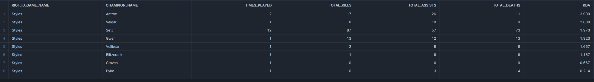

# Overview

This is a Jupyter Notebook where I extract data from League of Legends API, transform it and dump that data into Snowflake and CSV files(optional). 
Try to open the jupyter notebook [here](https://github.com/StylesAW/data_modeling/blob/main/data_modeling.ipynb)

**The second part of this project is the repository [data_pipeline](https://github.com/StylesAW/data_pipeline_lol) , where the process is automated using different technologies.**

## Setting Up the Environment

To get started, you can consider to set up a virtual environment and install the required dependencies. Follow these steps:

### 1. Create a Virtual Environment

First, create a virtual environment in your project directory. You can do this by running the following command:

```bash
python -m venv venv
```

### 2. Install Required Packages

With the virtual environment activated, install the dependencies listed in the `requirements.txt` file by running:
```bash
pip install -r requirements.txt
```
This command will install all the necessary libraries to run the Python script.

### 3. Set Up Snowflake

To use this project, you'll need to create an account in Snowflake. Once your account is set up, follow the next:

- **Run the SQL Query**: Execute the query provided in the `query_snowflake.sql` file. This query will set up the necessary architecture in Snowflake to store and manage the data extracted from the League of Legends API. You can find this file [query_snowflake](https://github.com/StylesAW/data_modeling/blob/main/query_snowflake.sql)

## Data Quality Check

To ensure everything is functioning correctly, I will present some queries that I performed to explore the data. These queries were designed to investigate the data and provide insights into its quality. The queries can be found in the `Analysis/analytical_queries.sql` file or clicking [analytical_queries](Analysis/analytical_queries.sql).

### Player Performance Analysis: Styles

The following query extracts the performance statistics of the specific player **Styles** for each champion, including data on kills, deaths, and assists. It also calculates the **KDA (Kill/Death/Assist)** ratio, which provides insight into the player's performance with that specific champion.

#### Understanding the KDA Calculation

The KDA ratio is a measure of a player's skill and effectiveness during a game. It is calculated as follows:

1. **Sum the number of kills and assists** performed by the player.
2. **Divide the result by the number of times the player died** during the match.
3. The resulting value is the **FINAL KDA**, where a higher KDA indicates superior performance and skill with the champion.


```sql
SELECT 
    riot_id_game_name,  
    CHAMPION_NAME,
    COUNT(*) as times_played,
    SUM(kills) as total_kills,
    SUM(assists) AS total_assists,
    SUM(deaths) AS total_deaths,
    ROUND((SUM(kills) + SUM(assists)) / NULLIF(SUM(DEATHS),0),3) AS KDA,
FROM matches
WHERE riot_id_game_name = 'Styles'
GROUP BY riot_id_game_name, champion_name
ORDER BY KDA DESC
```

### Result


***

### Most Used Items Analysis: Styles

The following query displays the most frequently used items by the player **Styles**, along with their relevant data as id, name and gold total. It excludes items that are not relevant to this analysis, such as **'Farsight Alteration'**, **'Oracle Lens'**, and **'Stealth Ward'**, as these are vision options and do not directly impact the player's performance.

#### Purpose of the Query

This query helps identify the key items that contribute to the player's performance by focusing only on those that provide meaningful gameplay advantages. By filtering out vision items, the analysis remains focused on combat-related choices.

```sql
SELECT
    A.riot_id_game_name,
    B.id,
    B.name,
    B.plaintext,
    B.gold_total,
    COUNT(B.name) AS most_used_items
FROM
    (SELECT riot_id_game_name, match_id, item0 AS item_id FROM matches
     UNION ALL
     SELECT riot_id_game_name, match_id, item1 FROM matches
     UNION ALL
     SELECT riot_id_game_name, match_id, item2 FROM matches
     UNION ALL
     SELECT riot_id_game_name, match_id, item3 FROM matches
     UNION ALL
     SELECT riot_id_game_name, match_id, item4 FROM matches
     UNION ALL
     SELECT riot_id_game_name, match_id, item5 FROM matches
     UNION ALL
     SELECT riot_id_game_name, match_id, item6 FROM matches) A
INNER JOIN 
    items B
ON 
    A.item_id = B.id
WHERE riot_id_game_name = 'Styles'
AND B.name <> 'Farsight Alteration'
AND B.name <> 'Oracle Lens'
AND B.name <> 'Stealth Ward'
GROUP BY A.riot_id_game_name, B.id, B.name, B.plaintext, B.gold_total
ORDER BY most_used_items DESC
LIMIT 10;
```

### Result 


***

```sql
SELECT 
    riot_id_game_name,
    COUNT(CASE WHEN win = TRUE THEN 1 END) AS total_Wins,
    COUNT(CASE WHEN win = FALSE THEN 1 END) AS total_defeats,
    ROUND(total_wins * 100 / COUNT(*),1) AS Winrate
FROM matches
WHERE riot_id_game_name = 'Styles'
GROUP BY riot_id_game_name
```


```sql
SELECT
win,
COUNT(*) AS count,
COUNT(*) * 100 / (SELECT COUNT(*) FROM matches WHERE riot_id_game_name = 'Styles') AS percentage
FROM matches
WHERE riot_id_game_name = 'Styles'
GROUP BY win
```


```sql
SELECT champion_name, COUNT(champion_name) AS most_used_champions
FROM matches
WHERE riot_id_game_name = 'Styles'
GROUP BY CHAMPION_NAME
ORDER BY most_used_champions DESC
```


```sql
SELECT riot_id_game_name ,AVG(game_duration/60) as average_in_minutes
FROM matches
WHERE riot_id_game_name = 'Styles'
GROUP BY riot_id_game_name
```

```sql
SELECT riot_id_game_name,AVG(gold_earned) AS average_gold_earned
FROM matches
WHERE riot_id_game_name = 'Styles'
AND (game_duration/60) < 20
GROUP BY riot_id_game_name
```


```sql
SELECT riot_id_game_name, MAX(total_minions_killed) AS max_minnions_killed, MIN(total_minions_killed) AS min_minions_killed
FROM MATCHES
WHERE (game_duration/60) > 20
GROUP BY riot_id_game_name
```

```sql
SELECT 
    ROW_NUMBER() OVER (PARTITION BY MATCH_ID ORDER BY TOTAL_DAMAGE_DEALT_TO_CHAMPIONS DESC) AS rank,
    MATCH_ID, 
    RIOT_ID_GAME_NAME,
    TOTAL_DAMAGE_DEALT_TO_CHAMPIONS, 
    TEAM_POSITION
FROM matches;
```


